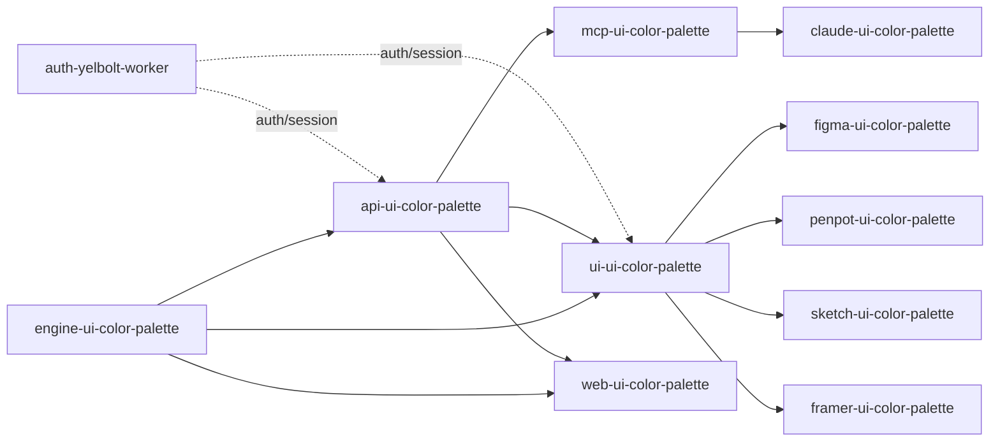

# Architecture — monorepo overview

- **Status**: Draft
- **Last updated**: 2026-07-30

> Reconstructed by reading the READMEs and code of `ui-ui-color-palette`. The dependency graph below is an inference, not a full `package.json` audit across all packages — fix it if any arrows are wrong.

## 1. Package map

The **UI Color Palette** product is spread across ~13 repos under `/Users/a_ng_d/DEV/ui-color-palette/`, all named `<surface>-ui-color-palette`.

| Package                   | Role                                                                                                                                                                                                                                                                                 | Stack                                               | Consumes                                                                       | Consumed by                                                                                                 |
| ------------------------- | ------------------------------------------------------------------------------------------------------------------------------------------------------------------------------------------------------------------------------------------------------------------------------------ | --------------------------------------------------- | ------------------------------------------------------------------------------ | ----------------------------------------------------------------------------------------------------------- |
| `engine-ui-color-palette` | Algorithmic core: color, contrast, palette generation, harmonies, dominant color extraction, color system. Published to npm as `@yelbolt/engine-ui-color-palette`. No network calls, pure classes (`Color`, `Contrast`, `Data`, `DominantColors`, `ColorHarmony`, `System`, `Code`). | TS, chroma.js, APCA-W3                              | —                                                                              | `api-ui-color-palette`, `ui-ui-color-palette`                                                               |
| `api-ui-color-palette`    | REST API versioned `/v1`, Cloudflare Worker. Wraps the engine + Supabase (published palettes) + Mistral AI (prompt generation) + passkey auth.                                                                                                                                       | Cloudflare Workers, Supabase (Postgres), Mistral AI | `engine-ui-color-palette`                                                      | `mcp-ui-color-palette`, `ui-ui-color-palette`, `web-ui-color-palette`                                       |
| `mcp-ui-color-palette`    | MCP server (Cloudflare Worker, `McpAgent` + Durable Objects), Streamable HTTP transport at `/mcp`. Thin 1:1 proxy to the API's `/v1` routes, OAuth 2.1 for authenticated tools.                                                                                                      | Cloudflare Agents SDK                               | `api-ui-color-palette`                                                         | MCP clients (Claude Desktop, VS Code/Copilot, **`claude-ui-color-palette`**)                                |
| `claude-ui-color-palette` | Claude Code plugin: skills + agents (orchestrator + 5 sub-agents) that drive `mcp-ui-color-palette` tools through a 4-phase guided workflow (Source / Palette / Deploy / Manage). Referenced in `claude-marketplace`.                                                                | Claude Code plugin (Markdown skills + agents)       | `mcp-ui-color-palette` (via MCP tools)                                         | Claude Code/Desktop users                                                                                   |
| `skills-ui-color-palette` | **Source of truth** for the skills, mirrored into `claude-ui-color-palette/skills`.                                                                                                                                                                                                    | Markdown                                            | —                                                                              | `claude-ui-color-palette` (mirrored in)                                                                     |
| `ui-ui-color-palette`     | Shared UI library (Preact): business logic + components common to the design tool plugins. Compiled per platform via `PLATFORM`/`EDITOR`/`COLOR_MODE` (Vite).                                                                                                                        | Preact, Vite, TS, Supabase, Mixpanel, Sentry        | `engine-ui-color-palette` (installed npm package, direct dependency — not a submodule), `api-ui-color-palette`, `@unoff/ui`, `@unoff/utils` | `figma-`, `penpot-`, `sketch-`, `framer-ui-color-palette` (as git submodule `packages/ui-ui-color-palette`) |
| `figma-ui-color-palette`  | Figma/FigJam plugin host.                                                                                                                                                                                                                                                            | Figma Plugin API                                    | `ui-ui-color-palette`                                                          | Figma users                                                                                                 |
| `penpot-ui-color-palette` | Penpot plugin host.                                                                                                                                                                                                                                                                  | Penpot Plugin API                                   | `ui-ui-color-palette`                                                          | Penpot users                                                                                                |
| `sketch-ui-color-palette` | Sketch plugin host.                                                                                                                                                                                                                                                                  | Sketch API                                          | `ui-ui-color-palette`                                                          | Sketch users                                                                                                |
| `framer-ui-color-palette` | Framer plugin host.                                                                                                                                                                                                                                                                  | Framer Plugin API                                   | `ui-ui-color-palette`                                                          | Framer users                                                                                                |
| `web-ui-color-palette`    | Standalone web application.                                                                                                                                                                                                                                                          | —                                                   | `engine-ui-color-palette` (installed npm package, direct dependency), `api-ui-color-palette` (assumed) | Web users                                                                                                   |
| `docs-ui-color-palette`   | **Public/user-facing** documentation, by surface (`api/`, `claude/`, `figma/`, `framer/`, `mcp/`, `penpot/`, `sketch/`, `legal/`).                                                                                                                                                   | —                                                   | —                                                                              | End users                                                                                                   |
| `specs-ui-color-palette`  | This folder. **Internal engineering** documentation.                                                                                                                                                                                                                                 | —                                                   | —                                                                              | Dev team                                                                                                    |

### Yelbolt cross-cutting infra (outside product scope, but an external dependency)

`auth-yelbolt`, `auth-yelbolt-worker`, `cors-yelbolt-worker`, `announcements-yelbolt-worker` — services shared across the Yelbolt platform (auth, CORS proxy, announcements), not specific to UI Color Palette. Treat as external contracts (see `04-contracts/`), not to be re-specified here.

## 2. Dependency flow

## 3. Two ways to drive the product

1. **Through a design tool host** (Figma, Penpot, Sketch, Framer): `ui-ui-color-palette` runs inside an iframe, communicates with the plugin sandbox via **messages** ([`04-contracts/events-messages.md`](../04-contracts/events-messages.md)) and triggers **bridges** ([`03-platform-bridges/bridge-actions.md`](../03-platform-bridges/bridge-actions.md)) that call the API or manipulate the design tool's document.
2. **Through an MCP client** (Claude Desktop, VS Code/Copilot, or the `claude-ui-color-palette` orchestrator): direct calls to [MCP tools](../04-contracts/mcp-tools.md), which proxy `api-ui-color-palette` without going through `ui-ui-color-palette`. This is the path this orchestrator takes.

Both paths converge on the same [API](../04-contracts/api-endpoints.md) and the same engine — this is what guarantees identical palette-generation behavior whether the user is in Figma or in Claude.

## 4. What this document deliberately does not cover

- UI component detail (`ui/components`, `ui/contexts`) — too volatile for a stable spec, document at feature level if needed (see [`02-features/`](../02-features/)).
- Supabase database schema — document in [`04-contracts/api-endpoints.md`](../04-contracts/api-endpoints.md) if a future development requires it.
- Per-platform build/deployment pipeline — belongs to each host repo, not to this cross-cutting product (see [`03-platform-bridges/`](../03-platform-bridges/) for what *is* covered per platform).

## See also

- [Glossary](glossary.md) — terms used throughout this map
- [Palette](../01-domain-model/palette.md), [Color System](../01-domain-model/color-system.md), [User context](../01-domain-model/user-context.md) — the domain model built on top of this architecture
- [Platform bridges](../03-platform-bridges/bridge-actions.md) — detail on path 1 above
- [Contracts](../04-contracts/api-endpoints.md) — detail on path 2 above
